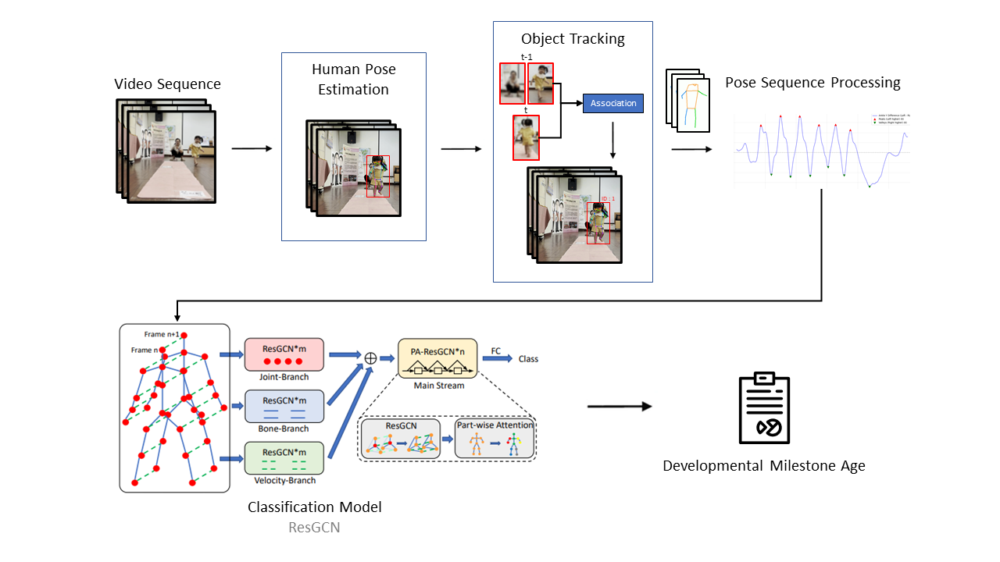
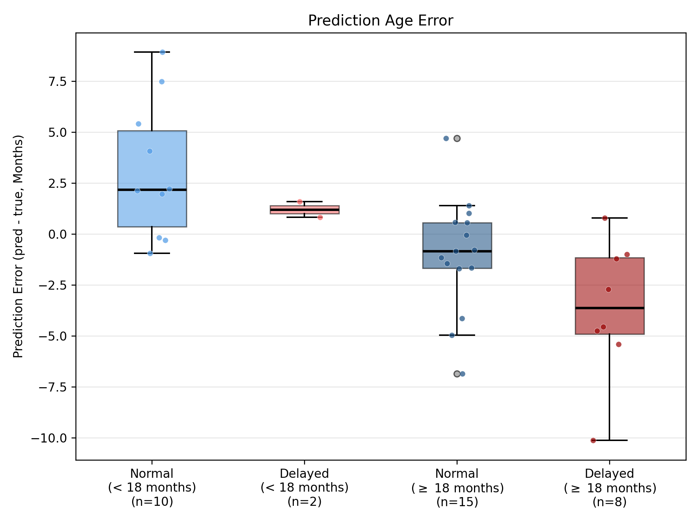
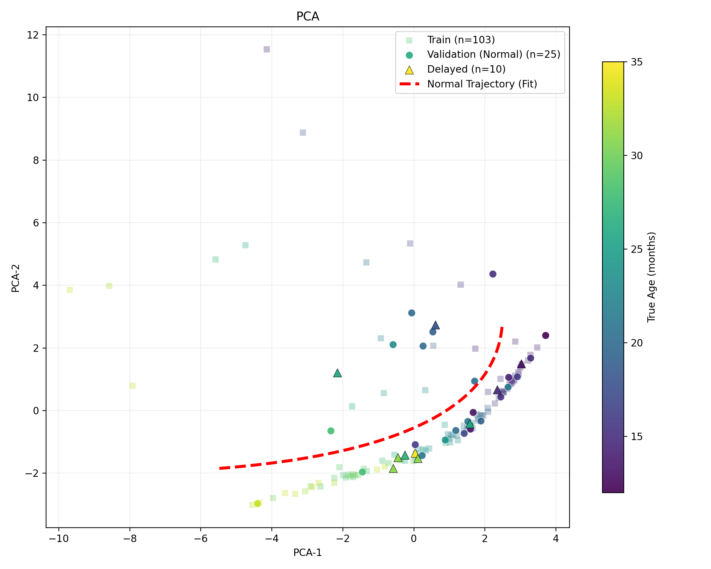

# 基於正、背面步態影片與圖卷積網路之嬰幼兒步態發展輔助評估方法

> **Infant Gait Developmental Assessment via Frontal/Dorsal Video Analysis and Graph Convolutional Networks**

[](https://www.python.org/)
[](https://pytorch.org/)
[](https://onnx.ai/)

---

## 研究成果一覽

本研究提出一套全自動化的嬰幼兒步態分析系統，主要達成以下功能與成果：

✅ **無痛早期篩查**：僅需一般智慧型手機拍攝的正背面步態影片，**無需昂貴的動作捕捉設備與穿戴裝置**，降低臨床甚至居家的早療篩查門檻。  
✅ **客觀量化指標**：透過分析步態特徵結合深度學習，輸出「預測月齡」作為步態成熟度的量化指標。  
✅ **驗證遲緩特徵**：證實發展遲緩嬰幼兒的預測月齡會「**系統性地低於**」實際月齡，此偏差將為早期療育提供強而有力的客觀依據。

| 指標 | 結果 |
|------|------|
| 平均絕對誤差（MSE） | **23.956 ± 7.158** |
| Spearman 等級相關係數 ρ | **0.735 ± 0.136** |
| 資料規模 | 140 位嬰幼兒（12–36 個月） |
| 驗證策略 | 5-Fold Cross-Validation + 獨立遲緩組測試 |

---

## 核心技術棧

**核心領域**：`人體姿態估計 (Human Pose Estimation)` · `多目標追蹤 (Multi-Object Tracking)` · `深度學習圖卷積網路 (GCN)` · `特徵工程 (Feature Engineering)`  
**技術與框架**：`PyTorch` · `ONNX Runtime` · `RTMO-L` · `BoT-SORT` · `Label Distribution Learning (LDL)` · `OpenCV` · `scikit-learn` · `UMAP`

---

## 研究動機

嬰幼兒發展遲緩的早期評估高度依賴**專業人員主觀判斷**，且現有量化工具（動作捕捉系統）設備昂貴、難以普及。本研究提出一套自動化管線，利用一般手機拍攝的正背面步態影片，以「預測月齡」量化步態成熟度。

**核心洞見：** 模型以正常嬰幼兒資料訓練，對於發展遲緩案例，其**預測月齡會系統性地低於實際月齡**，此偏差可作為早療篩查的量化指標。

---

## 系統架構

本系統實現了從影片輸入到評估結果輸出的**端對端 (End-to-End) 自動化分析**。整體架構分為四個核心模組：
1. **多目標姿態估計與追蹤**：從複雜背景中精確提取多人骨架，並穩定追蹤目標幼兒。
2. **三階段骨架正規化**：消除嬰幼兒體型差異與拍攝距離的干擾。
3. **步態有效段偵測**：過濾坐姿與轉身雜訊，自動擷取連續的有效行走片段。
4. **PA-ResGCN 模型預測**：將骨架轉換為圖結構特徵，動態評估步態成熟度並輸出機率分布。



---

### 第一階段：多目標姿態估計、追蹤與幼兒辨識

臨床拍攝場景往往包含**照護者、其他兒童與複雜背景**，如何從多人場景中精確鎖定目標幼兒是本研究的核心挑戰之一。本研究設計了一套三層辨識機制：

**1-A. 人體姿態估計與跨幀追蹤**  
以 **RTMO-L**（ONNX 部署）對每幀進行同步多人骨架偵測（17 個 COCO 關鍵點），搭配 **BoT-SORT** 維持目標在幀間的一致 ID，應對嬰幼兒頻繁停頓、遮擋與方向轉換等問題。

**1-B. 骨架品質預處理**

| 步驟 | 機制 | 目的 |
|------|------|------|
| 關鍵點信心過濾 | 信心分數 < 0.5 的關鍵點設為遮擋 | 排除姿態估計失誤幀 |
| 短軌跡剔除 | 持續 < 90 幀的軌跡直接捨棄 | 去除畫面中短暫路過人物 |
| 遮擋插值補償 | 短暫遮擋（≤ 30 幀）線性插值補全 | 維持人物軌跡不間斷 |

**1-C. 幼兒身份辨識（Cross-Track Identification）**  
利用嬰幼兒特有的身體比例特徵進行跨軌跡辨識，在站立段中計算每條軌跡的**頭身比中位數**（< 4.0）與**坐高指數中位數**（> 58.0），同時滿足兩個條件者才被判定為目標幼兒。若多條軌跡同時符合（如多位幼兒入鏡），以 `head_ratio / sitting_index` 最小者作為代表，確保不將家長或照護者誤認為受測者。

---

### 第二階段：三階段骨架正規化

為消除個體體型、拍攝距離與位移的影響，依序施以三道正規化：

| 步驟 | 方法 | 消除影響 |
|------|------|---------|
| 平移正規化 | 以肩膀中點為原點 | 在畫面中的絕對位置偏移 |
| 縮放正規化 | 固定軀幹長度比例（scale=2.0） | 身高與拍攝距離的差異 |
| 時序平滑 | Gaussian filter（σ=0.5） | 姿態估計模型造成的輕微抖動 |

---

### 第三階段：步態有效段偵測

嬰幼兒步態高度不規律，系統以四層遞進條件篩選有效行走段，最終自動匯出特徵穩定的 **128 幀**片段：

1. **站立判定**：軀幹與下肢夾角 > 120°
2. **軀幹比例過濾**：排除坐姿、俯臥、或攝影角度過度偏斜幀
3. **踝關節交替偵測**：左右踝關節峰值交替 ≥ 3 個完整週期
4. **固定長度切段**：動態裁切 128 幀做為深度學習網路之標準輸入

---

### 第四階段：PA-ResGCN 月齡預測

**模型：** `PA-ResGCN-B15-R2`（Part-Attention Residual Graph Convolutional Network）

| 設計元件 | 說明 |
|---------|------|
| **多分支特徵輸入** | Joint（關節座標）+ Bone（骨架幾何向量）+ Velocity（時序運動速度），多維度捕捉空間與時間的微小動態 |
| **部位注意力（Part-Attention）** | 使模型對髖、膝、踝等**步態核心節點**施以更高權重，聚焦關鍵生理特徵 |
| **標籤分布學習（LDL）** | 以 8 個月齡的 Gaussian 機率分布取代單一點數值，精準捕獲發展呈「過渡連續性」的不確定現象 |
| **複合損失函數** | Ordinal KL Divergence + EMD，保留序列性的年齡順序關係 |

---

## 實驗結果

### 預測效能


Spearman ρ = **0.735** 驗證預測月齡與實際月齡具有顯著正相關，模型有效學習到了嬰幼兒步態由蹣跚走向成熟的標準發展軌跡。

### 發展遲緩篩查驗證



模型以**全數正常樣本進行訓練**，接著在遲緩組（n=10）的獨立測試集演練中，發現 18 個月以上幼兒的預測月齡呈現全面性的**異常偏低**。此項跨族群的泛化結果，確認了該預測偏差具有作為**早療量化輔助篩查**的極高潛力。

### PCA / UMAP 特徵空間視覺化



### 消融研究

| 比較項目 | 結論 |
|---------|------|
| **LDL 機制 vs. 點回歸（L1/MSE）** | LDL 在 Spearman ρ 及 MAE 誤差衡量上皆勝過傳統回歸 |
| **三分支 vs. 單分支輸入** | 結合三種不同的運動向量特徵遠優於單一資訊輸入 |
| **Ordinal KL+EMD vs. 純 KL** | 配合 Ordinal 的概念可以避免年齡順序錯置的誤判缺點 |

---

## 資料集

| 項目 | 詳情 |
|------|------|
| 合作機構 | 馬偕紀念醫院早期療育團隊 |
| 總受試人數 | **140 位**嬰幼兒 |
| 月齡範圍 | 12 – 36 個月 |
| 正常發展組 | **130 位**（5-Fold Cross-Validation 訓練與驗證） |
| 發展遲緩組 | **10 位**（獨立測試集） |
| 影片視角 | 正面（Frontal）/ 背面（Dorsal） |
| 拍攝設備 | 一般智慧型手機（無需專業設備） |

---

## 引用

```bibtex
@mastersthesis{author2025wetpaint,
  title  = {基於正、背面步態影片與圖卷積網路之嬰幼兒步態發展輔助評估方法},
  author = {古雲鄉},
  school = {國立台北科技大學},
  year   = {2026}
}
```

---

> 本系統為學術研究輔助工具，其輸出**不構成醫療診斷**，臨床決策應由專業醫療人員進行最終判斷。
