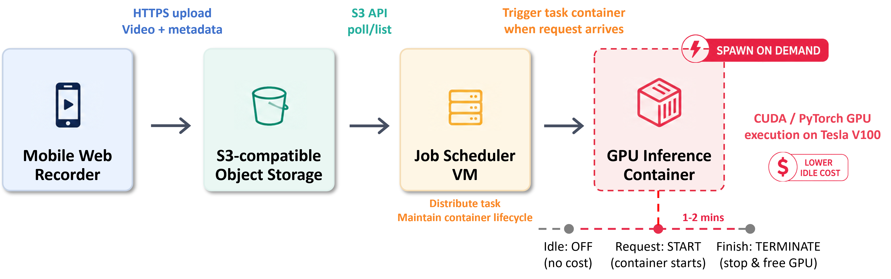
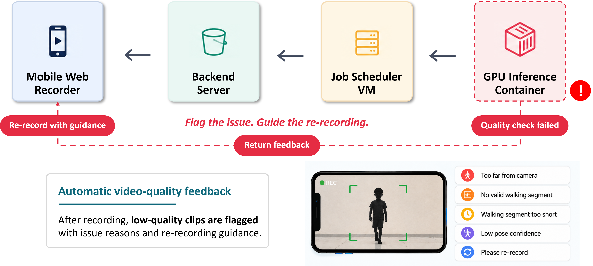
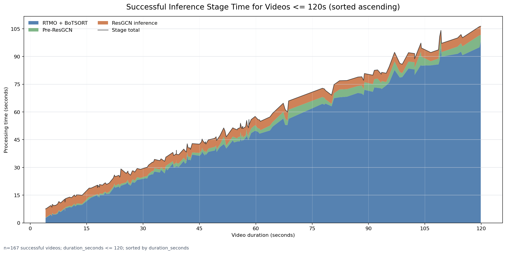
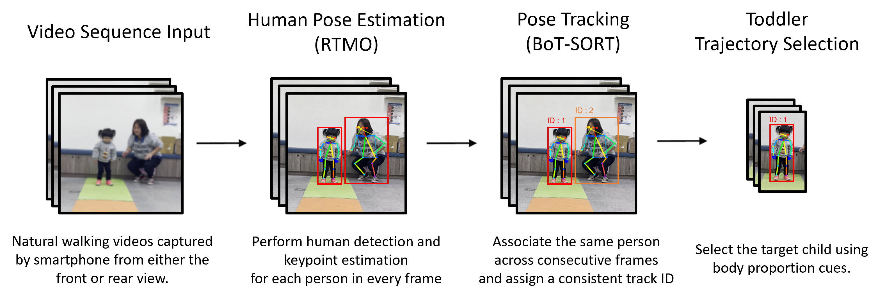
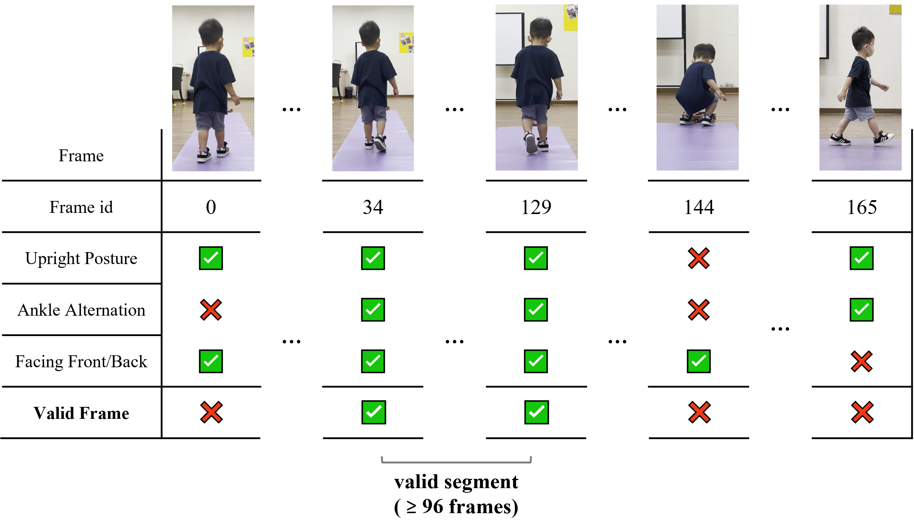
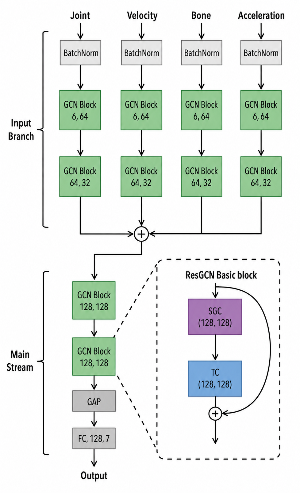
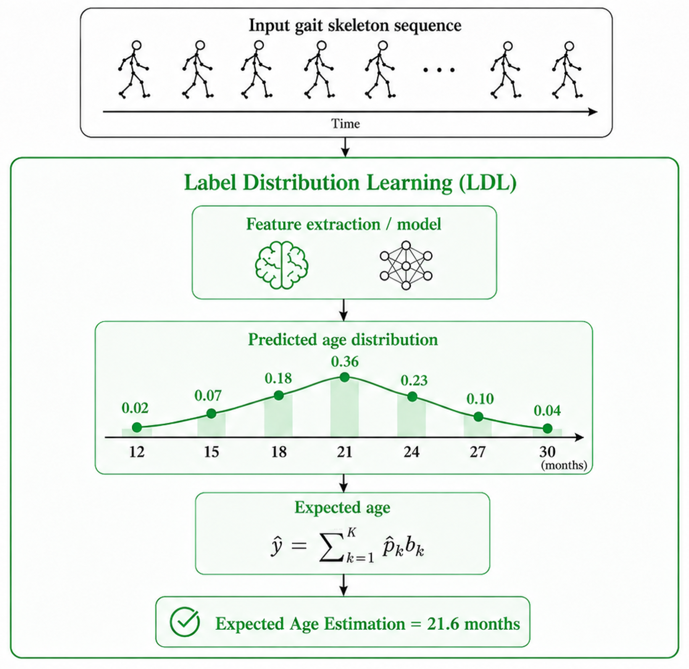
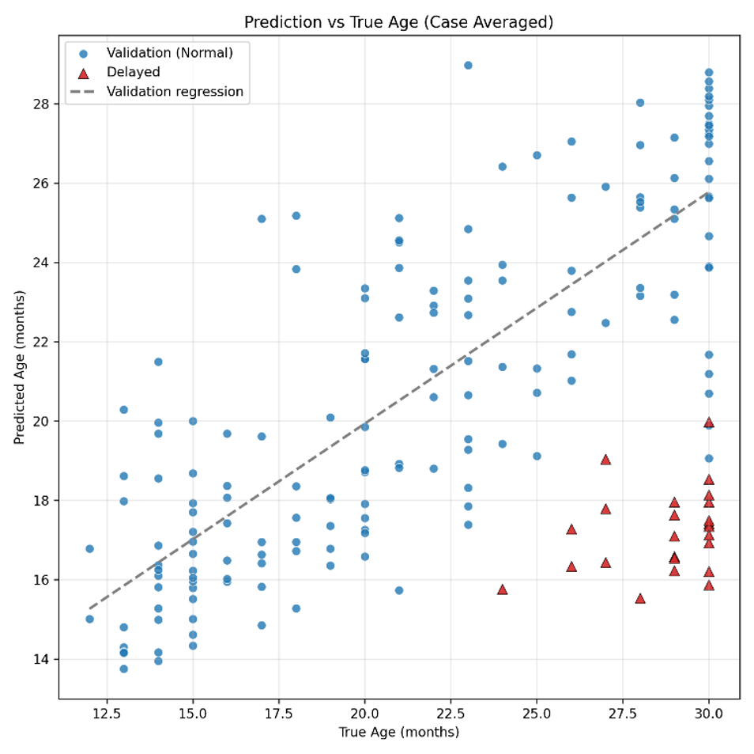
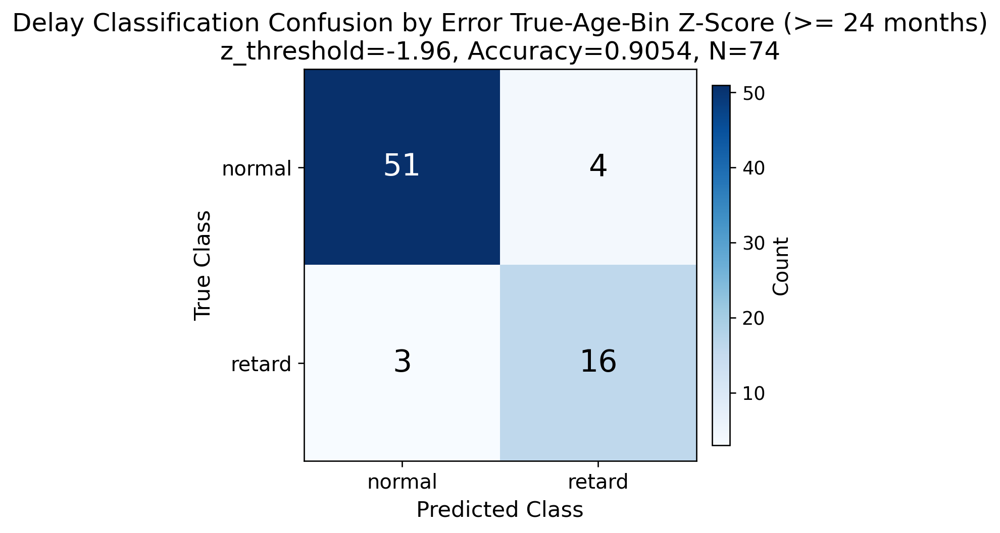

# AI-based Toddler Gait Development Assessment System

> Deep skeleton-based spatiotemporal modeling for toddler gait developmental-age estimation and developmental-delay risk screening.

[](https://www.python.org/)
[](https://pytorch.org/)
[](https://onnx.ai/)
[](#technical-stack)

## Overview

本專案是一套以自然行走影片為輸入的幼兒步態發展輔助評估系統。系統會從手機拍攝的正面或背面步態影片中，自動擷取幼兒骨架序列，經過目標追蹤、步態片段篩選、骨架正規化與 ResGCN 時序建模後，輸出「步態發展月齡」與「發展遲緩風險分數」。

研究目標不是取代臨床診斷，而是建立一個可重複、低侵入、可部署於雲端的篩檢輔助流程，協助早期療育或社區篩檢場域更有效率地觀察幼兒粗大動作發展。

## Motivation

幼兒發展遲緩的早期辨識高度仰賴專業人員、標準化量表與臨床場域，對大規模社區篩檢或長期追蹤而言成本較高。步態是粗大動作發展中自然且高頻出現的行為，能反映姿勢穩定、下肢支撐、左右腳交替與神經肌肉協調能力。

因此，本研究嘗試把「日常影片」轉換為「可量化的骨架時序資料」，再透過圖卷積網路學習與月齡成熟度相關的步態特徵，讓臨床人員在傳統評估之外，取得更客觀且可規模化的輔助指標。

## System Pipeline


```text
Video Upload
  -> Pose Estimation
  -> Tracking
  -> Gait Segment Extraction
  -> Skeleton Normalization
  -> ResGCN Inference
  -> Developmental Age / Risk Score
```

## Key Features

- Natural-video gait analysis: 支援手機拍攝之正面或背面自然行走影片。
- Multi-person handling: 使用 RTMO-L 與 BoT-SORT 在照顧者、醫療人員同框時維持目標軌跡一致性。
- Toddler target identification: 以幼兒身體比例特徵協助從多條追蹤軌跡中選出目標幼兒。
- Gait-focused and Skeleton-based temporal modeling: 將關鍵點簡化為 8 個與步態相關的點以降低非步態動作干擾，並以輕量化 ResGCN 建模關節拓樸與跨影格動態變化。。
- Developmental-age estimation: 以 Label Distribution Learning 輸出月齡分布，並以期望值解碼為步態發展月齡。
- Risk scoring: 以預測月齡與實際月齡的方向性誤差 z-score 作為發展遲緩風險指標。

## Deployment

系統已部署為雲端推論服務，將影片上傳、任務排程、GPU 容器啟動、骨架擷取與模型推論拆成可維護的處理流程。整體設計採用 on-demand inference：平時由輕量 VM 與物件儲存維持服務狀態，當使用者上傳影片後才觸發 GPU 推論容器，以降低閒置成本。



在正常推論流程中，使用者首先透過行動網頁錄影介面錄製幼兒步態影片，系統會將影片檔案與相關任務資訊透過安全網路連線上傳至物件儲存空間。Job Scheduler VM 會定期檢查儲存空間中是否有尚未處理的推論任務；當偵測到新的請求後，即啟動GPU推論容器，進行後續影像分析與模型推論。

推論容器啟動後，系統會依序完成影像姿態估測、受試者追蹤、步態片段擷取、骨架序列整理與特徵建立等步驟。接著，將處理後的骨架時序資料輸入月齡推論模型，以估計幼兒的發展月齡。最後，系統會根據模型輸出結果計算發展月齡預測值、標準化分數與遲緩風險等級，並將結果回傳至前端或後續資料儲存模組，作為臨床或研究人員進一步判讀之參考。




除了成功推論外，系統亦設計影片品質例外處理機制。若 GPU 推論在品質檢查階段偵測到影片不可用，任務不會直接輸出風險分數，而是將失敗原因回傳至後端伺服器，再由行動網頁錄影介面顯示重錄指引。常見例外包含距離鏡頭太遠、沒有有效步態片段、步態片段過短、姿態信心分數過低等。這個流程讓使用者能在前端重新錄製更合格的影片，也避免低品質輸入造成不可靠的模型推論結果。

TWCC GPU 節點可用於姿態估測與批次影片推論；Job Scheduler VM 則負責任務分派與容器生命週期管理。實務上，RTMO-L 是整體流程中最主要的計算瓶頸，因此採用 on-demand GPU container 可在推論效能與閒置成本之間取得平衡，單次推論任務約以 1 至 2 分鐘為目標。



上圖為成功推論影片的 stage-level 時間測量結果，共統計 341 支長度不超過 120 秒的影片。結果顯示整體處理時間會隨影片長度增加而上升，其中 RTMO + BoT-SORT 佔據主要推論時間；Pre-ResGCN 特徵整理與 ResGCN inference 則相對輕量。這也說明部署優化的重點應優先放在姿態估測、追蹤流程與 GPU 容器啟動策略，而不是 ResGCN 模型本身。

## Technical Stack

| Area | Tools / Methods |
| --- | --- |
| Language | Python |
| Deep Learning | PyTorch, ResGCN, Label Distribution Learning |
| Pose Estimation | RTMO-L, ONNX Runtime |
| Tracking | BoT-SORT, multi-object tracking |
| Video Processing | OpenCV, 30 fps video normalization |
| Modeling Input | COCO-17 keypoints, 8-joint gait skeleton, joint / velocity / bone / acceleration streams |
| Evaluation | 5-fold cross-validation, MAE, RMSE, Pearson, Spearman, ROC-AUC |
| Deployment | TWCC GPU cloud, REST API, batch/video inference service |

## Method

### Data

資料由馬偕紀念醫院早期療育評估中心協助蒐集，研究對象為 12 至 36 個月幼兒之自然步態影片。影片以智慧型手機搭配腳架拍攝，攝影機約距幼兒 2.5 公尺，包含居家、早療門診與社區篩檢等非受控場域。

有效分析資料包含 178 位個案，其中正常發展組 159 人、發展遲緩組 19 人。正常組用於模型訓練與五折交叉驗證；遲緩組保留作為外部風險分析。所有資料皆經 IRB 審核並去識別化處理。

### Pose And Tracking

影片先統一轉為 30 fps、1080 x 1920 直式解析度。RTMO-L 於每一影格輸出人體邊界框、17 個 COCO 關鍵點與信心分數；BoT-SORT 則將跨影格偵測結果串接為連續軌跡。

為提升自然場景穩定性，系統加入下列過濾策略：

- 移除過於接近影像邊界的人物框，降低截斷骨架影響。
- 以平均關鍵點信心分數篩選骨架，門檻設定為 0.7。
- 對不超過 5 幀的短暫缺失進行時間內插。
- 使用上、下身段比例辨識目標幼兒，候選門檻為比例中位數大於 1.3。

### Gait Segment Extraction

系統會從連續骨架軌跡中擷取穩定步態區段，避免起步、停止、轉身、蹲下、爬行或姿態估測異常片段進入模型。主要條件包含：

- 直立姿態：左右膝關節角需大於約 120 度。
- 骨架比例合理性：軀幹長度與髖寬比值需小於等於 3.5。
- 左右腳交替：偵測左右踝垂直位移差之峰谷交替，並保留步頻約 1.5 至 3.5 steps/s 的片段。
- 固定長度切割：有效區段切為 96 幀子序列，約對應 3 秒步態資料。






### Skeleton Normalization

模型輸入前會將每幀骨架轉換到相對座標系。系統以髖部中心作為原點，並以肩部中心到髖部中心的軀幹長度進行尺度正規化，以降低拍攝距離、人物位置與個體身形差異對模型的影響。

### Model Architecture

本研究未直接使用完整 COCO-17 骨架，而是保留左右肩、左右髖、左右膝、左右踝共 8 個步態關鍵點。骨架拓樸包含肩部連線、髖部連線、肩髖軀幹連線，以及左右髖-膝-踝下肢鏈結。

ResGCN 採多分支輸入設計：

- Joint: 關節位置與相對中心節點位置。
- Velocity: 一階時間差分，描述關節速度與方向變化。
- Bone: 骨段向量，描述肢段幾何關係。
- Acceleration: 二階時間差分，描述啟動、減速與支撐切換。

各分支先經兩個 ResGCN 模組抽取低階特徵，再串接為 128 通道融合特徵，接著由 AttGCN 主幹進行空間圖卷積、時間卷積、殘差映射與部位注意力加權。最後透過 global average pooling、dropout 與全連接層輸出月齡標籤 logits。



### Label Design

幼兒發展月齡不是硬分類問題，因此本研究使用 Label Distribution Learning。模型以 7 個月齡中心作為標籤空間：

```text
{12, 15, 18, 21, 24, 27, 30}
```

真實月齡會轉換為 Gaussian 目標分布，平滑參數 sigma = 1。模型輸出經 softmax 得到月齡機率分布，再以期望值解碼為連續的預測步態發展月齡。訓練時以 KL divergence 讓預測分布逼近目標分布。



## Results

### Developmental Age Estimation

| Evaluation Level | Samples | MAE (months) | RMSE (months) | Pearson | Spearman |
| --- | ---: | ---: | ---: | ---: | ---: |
| Segment-level | 419 segments | 2.775 | 3.556 | 0.771 | 0.773 |
| Case-level | 159 cases | 2.794 | 3.543 | 0.803 | 0.802 |

### 5-fold Cross-validation

| Fold | MAE | MSE | RMSE | Pearson | Spearman |
| --- | ---: | ---: | ---: | ---: | ---: |
| 1 | 3.172 | 14.565 | 3.816 | 0.719 | 0.691 |
| 2 | 2.324 | 9.715 | 3.117 | 0.847 | 0.853 |
| 3 | 2.607 | 11.313 | 3.363 | 0.817 | 0.806 |
| 4 | 2.878 | 13.571 | 3.684 | 0.784 | 0.757 |
| 5 | 2.895 | 13.947 | 3.735 | 0.719 | 0.747 |
| Mean | 2.775 | 12.622 | 3.543 | 0.777 | 0.771 |
| Std | 0.288 | 1.822 | 0.263 | 0.052 | 0.055 |



### Risk Score Analysis

系統以 case-level 預測月齡與實際月齡之方向性誤差建立 z-score。當模型預測的步態發展月齡明顯低於實際月齡時，代表個案可能呈現相對落後的步態成熟度。

| Analysis Set | Normal Cases | Delayed Cases | Risk Score | ROC-AUC |
| --- | ---: | ---: | --- | ---: |
| 24+ months | 55 | 19 | negative directional z-score | 0.979 |
| All cases | 159 | 19 | negative directional z-score | 0.989 |



固定閾值篩檢結果如下。此表呈現模型在風險分數轉為二元篩檢判定後的整體分類能力，並列出 95% confidence interval。

| Metric | Estimate | 95% CI |
| --- | ---: | ---: |
| AUC | 0.989 | 0.975-0.998 |
| Sensitivity | 84.21% | 68.42%-99.18% |
| Specificity | 97.48% | 94.97%-99.37% |
| F1 | 82.05% | 68.42%-92.68% |
| Accuracy | 90.54% | 83.78%-97.30% |


## Limitations

- 本系統為研究型輔助工具，不是臨床診斷系統；任何風險提示都應由醫師、治療師或早療專業人員進一步判讀。
- 資料集仍受樣本數與場域限制影響，特別是發展遲緩組目前集中於 24 個月以上。
- 影片品質、遮擋、拍攝角度、照顧者同框與幼兒非穩定行走都可能影響姿態估測與片段擷取。
- 目前主要使用 2D 骨架，尚未納入深度資訊、足底接觸事件或臨床量表分數的多模態融合。
- 未來可擴充更大規模資料集、跨醫院驗證、模型校準、前端回饋介面與可解釋性視覺化。

## What I Learned

這個專案讓我完整實作並整合了從研究問題定義到雲端推論原型的 AI 系統流程：

- Computer vision: 將姿態估測、多人追蹤與自然場景品質控制整合到可用 pipeline。
- Deep learning: 使用 ResGCN、時空圖表示與 Label Distribution Learning 解決連續月齡估計問題。
- Data engineering: 處理非受控影片、骨架正規化、片段切割、五折交叉驗證與個案層級聚合。
- Medical AI thinking: 理解模型輸出需要轉換為臨床可解釋的輔助指標，而不是只追求單一準確率。
- Deployment mindset: 將研究模型拆解為 REST API、GPU worker、推論流程與可視化結果，往實際應用靠近。
